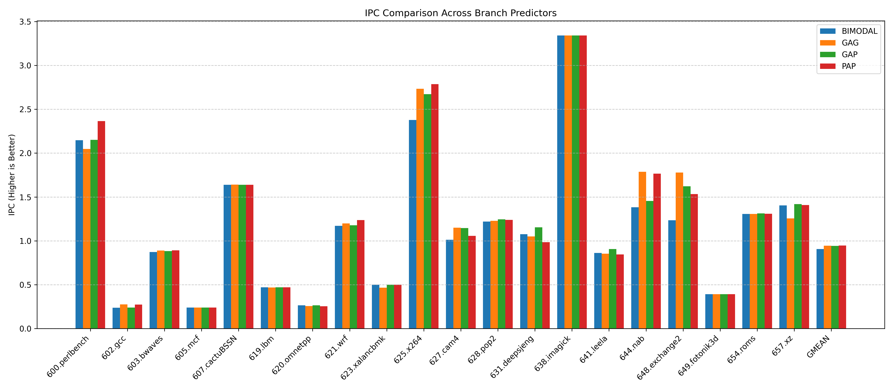
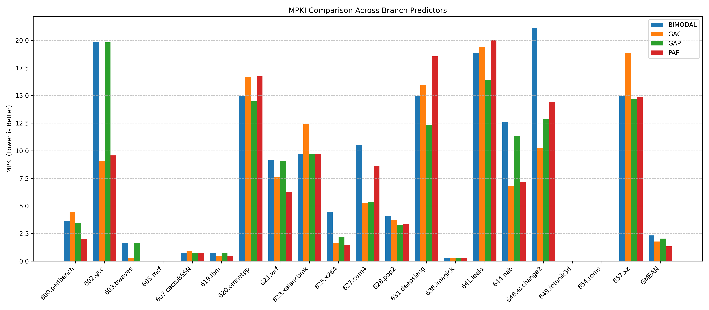

 # HW2: Branch prediction

## 1. Assignment
In this assignment, I implemented and compared three two-level adaptive branch predictors (`GAg`, `GAp`, `PAp`) against the baseline `Bimodal` predictor. All predictors were configured to use roughly the same hardware budget (~32 Kb).

## 2. Results

### Metrics
|               |   BIMODAL_IPC |   BIMODAL_MPKI |   GAG_IPC |   GAG_MPKI |   GAP_IPC |   GAP_MPKI |   PAP_IPC |   PAP_MPKI |
|:--------------|--------------:|---------------:|----------:|-----------:|----------:|-----------:|----------:|-----------:|
| 600.perlbench |        2.1460 |         3.6250 |    2.0480 |     4.4780 |    2.1510 |     3.4850 |    2.3650 |     2.0100 |
| 602.gcc       |        0.2381 |        19.8500 |    0.2751 |     9.0890 |    0.2386 |    19.8200 |    0.2740 |     9.5680 |
| 603.bwaves    |        0.8715 |         1.6360 |    0.8894 |     0.2752 |    0.8831 |     1.6360 |    0.8913 |     0.0028 |
| 605.mcf       |        0.2402 |         0.0377 |    0.2405 |     0.0226 |    0.2403 |     0.0378 |    0.2404 |     0.0219 |
| 607.cactuBSSN |        1.6390 |         0.7521 |    1.6410 |     0.9362 |    1.6380 |     0.7481 |    1.6390 |     0.7500 |
| 619.lbm       |        0.4694 |         0.7376 |    0.4692 |     0.4444 |    0.4694 |     0.7376 |    0.4695 |     0.4631 |
| 620.omnetpp   |        0.2640 |        14.9800 |    0.2563 |    16.7000 |    0.2655 |    14.4700 |    0.2537 |    16.7400 |
| 621.wrf       |        1.1710 |         9.2010 |    1.1990 |     7.6430 |    1.1770 |     9.0480 |    1.2370 |     6.2710 |
| 623.xalancbmk |        0.5008 |         9.7010 |    0.4666 |    12.4300 |    0.5008 |     9.7010 |    0.5008 |     9.7060 |
| 625.x264      |        2.3780 |         4.4320 |    2.7340 |     1.6220 |    2.6710 |     2.2100 |    2.7860 |     1.4680 |
| 627.cam4      |        1.0120 |        10.5000 |    1.1500 |     5.2440 |    1.1450 |     5.3610 |    1.0560 |     8.6110 |
| 628.pop2      |        1.2190 |         4.0690 |    1.2290 |     3.7250 |    1.2450 |     3.2850 |    1.2390 |     3.4000 |
| 631.deepsjeng |        1.0750 |        14.9700 |    1.0500 |    15.9800 |    1.1540 |    12.3500 |    0.9854 |    18.5400 |
| 638.imagick   |        3.3410 |         0.3130 |    3.3410 |     0.3158 |    3.3410 |     0.3132 |    3.3410 |     0.3135 |
| 641.leela     |        0.8629 |        18.8200 |    0.8532 |    19.3800 |    0.9066 |    16.4300 |    0.8457 |    20.0000 |
| 644.nab       |        1.3820 |        12.6400 |    1.7870 |     6.8060 |    1.4550 |    11.3300 |    1.7650 |     7.1880 |
| 648.exchange2 |        1.2340 |        21.1000 |    1.7790 |    10.2300 |    1.6220 |    12.8900 |    1.5340 |    14.4400 |
| 649.fotonik3d |        0.3926 |         0.0044 |    0.3925 |     0.0066 |    0.3926 |     0.0044 |    0.3926 |     0.0044 |
| 654.roms      |        1.3070 |         0.0215 |    1.3060 |     0.0245 |    1.3130 |     0.0229 |    1.3080 |     0.0248 |
| 657.xz        |        1.4040 |        14.9500 |    1.2560 |    18.8700 |    1.4190 |    14.6900 |    1.4090 |    14.8600 |
| GMEAN         |        0.9071 |         2.3219 |    0.9439 |     1.7865 |    0.9417 |     2.0428 |    0.9466 |     1.3405 |
