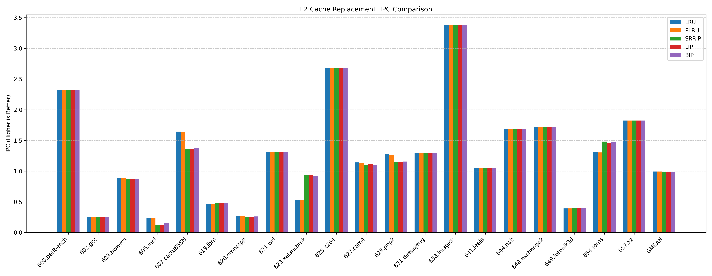
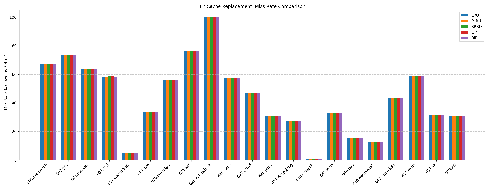

# HW3: L2 Cache replacement and insertion policies

## 1. Assignment
This assignment explores cache pollution mitigation in the L2 cache. I implemented and evaluated `Pseudo-LRU (PLRU)`, `SRRIP`, `LIP` (LRU Insertion Policy), and `BIP` (Bimodal Insertion Policy, $\epsilon=1/32$) against the baseline `LRU`.

## 2. Results

### Metrics
|               |   LRU_IPC |   LRU_MISS |   PLRU_IPC |   PLRU_MISS |   SRRIP_IPC |   SRRIP_MISS |   LIP_IPC |   LIP_MISS |   BIP_IPC |   BIP_MISS |
|:--------------|----------:|-----------:|-----------:|------------:|------------:|-------------:|----------:|-----------:|----------:|-----------:|
| 600.perlbench |    2.3260 |    67.3684 |     2.3260 |     67.3684 |      2.3260 |      67.3684 |    2.3260 |    67.3684 |    2.3260 |    67.3684 |
| 602.gcc       |    0.2524 |    73.8610 |     0.2524 |     73.8610 |      0.2524 |      73.8609 |    0.2524 |    73.8609 |    0.2525 |    73.8609 |
| 603.bwaves    |    0.8841 |    63.6482 |     0.8840 |     63.5956 |      0.8685 |      63.7385 |    0.8683 |    63.7401 |    0.8696 |    63.7278 |
| 605.mcf       |    0.2404 |    57.9729 |     0.2376 |     57.9087 |      0.1277 |      58.6510 |    0.1284 |    58.6956 |    0.1549 |    58.2916 |
| 607.cactuBSSN |    1.6440 |     5.1172 |     1.6410 |      5.1525 |      1.3610 |       5.1891 |    1.3590 |     5.1735 |    1.3740 |     5.1135 |
| 619.lbm       |    0.4697 |    33.7835 |     0.4691 |     33.7627 |      0.4839 |      33.7494 |    0.4823 |    33.7929 |    0.4766 |    33.7357 |
| 620.omnetpp   |    0.2743 |    55.9733 |     0.2734 |     55.9675 |      0.2572 |      55.9688 |    0.2576 |    55.9575 |    0.2612 |    55.9992 |
| 621.wrf       |    1.3060 |    76.6219 |     1.3060 |     76.6219 |      1.3060 |      76.6219 |    1.3060 |    76.6219 |    1.3060 |    76.6219 |
| 623.xalancbmk |    0.5303 |    99.9292 |     0.5343 |     99.9292 |      0.9421 |      99.9290 |    0.9421 |    99.9290 |    0.9259 |    99.9290 |
| 625.x264      |    2.6820 |    57.7381 |     2.6820 |     57.7381 |      2.6820 |      57.7381 |    2.6820 |    57.7381 |    2.6820 |    57.7381 |
| 627.cam4      |    1.1410 |    46.7926 |     1.1290 |     46.7972 |      1.0940 |      46.7948 |    1.1110 |    46.7942 |    1.0980 |    46.7940 |
| 628.pop2      |    1.2780 |    30.7326 |     1.2680 |     30.7362 |      1.1500 |      30.7730 |    1.1530 |    30.7634 |    1.1570 |    30.8314 |
| 631.deepsjeng |    1.2970 |    27.4183 |     1.2970 |     27.4183 |      1.2970 |      27.4183 |    1.2970 |    27.4183 |    1.2970 |    27.4183 |
| 638.imagick   |    3.3780 |     0.4513 |     3.3780 |      0.4513 |      3.3780 |       0.4513 |    3.3780 |     0.4513 |    3.3780 |     0.4513 |
| 641.leela     |    1.0490 |    33.1252 |     1.0480 |     33.1252 |      1.0550 |      33.1252 |    1.0540 |    33.1252 |    1.0540 |    33.1252 |
| 644.nab       |    1.6900 |    15.3847 |     1.6900 |     15.3847 |      1.6900 |      15.3847 |    1.6900 |    15.3847 |    1.6900 |    15.3847 |
| 648.exchange2 |    1.7230 |    12.4196 |     1.7230 |     12.4196 |      1.7230 |      12.4196 |    1.7230 |    12.4196 |    1.7230 |    12.4196 |
| 649.fotonik3d |    0.3923 |    43.4816 |     0.3921 |     43.4768 |      0.4009 |      43.4816 |    0.4031 |    43.4816 |    0.4023 |    43.4816 |
| 654.roms      |    1.3050 |    58.8105 |     1.3040 |     58.8144 |      1.4810 |      58.7890 |    1.4640 |    58.7972 |    1.4800 |    58.8011 |
| 657.xz        |    1.8240 |    31.1939 |     1.8240 |     31.1939 |      1.8240 |      31.1939 |    1.8240 |    31.1939 |    1.8240 |    31.1939 |
| GMEAN         |    0.9944 |    31.0764 |     0.9929 |     31.0832 |      0.9800 |      31.1182 |    0.9806 |    31.1162 |    0.9898 |    31.0891 |
